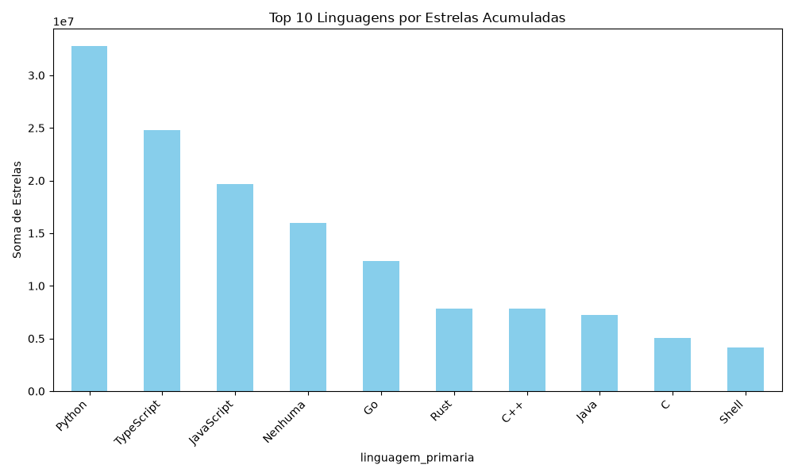
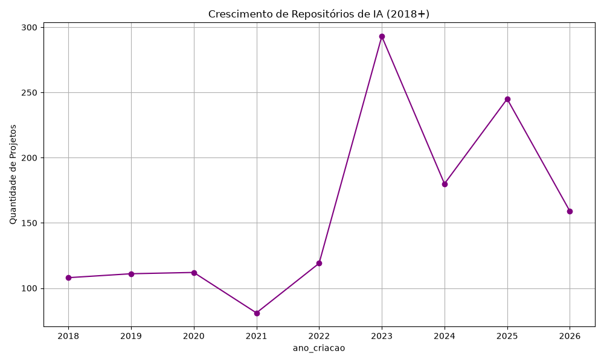
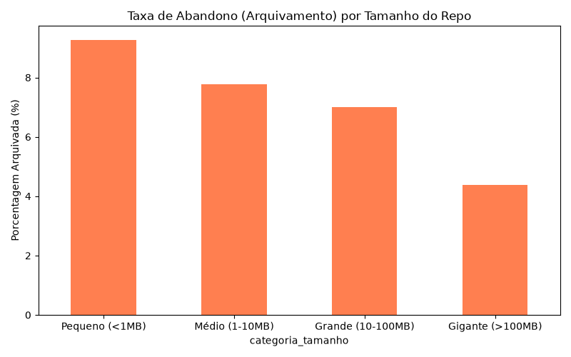
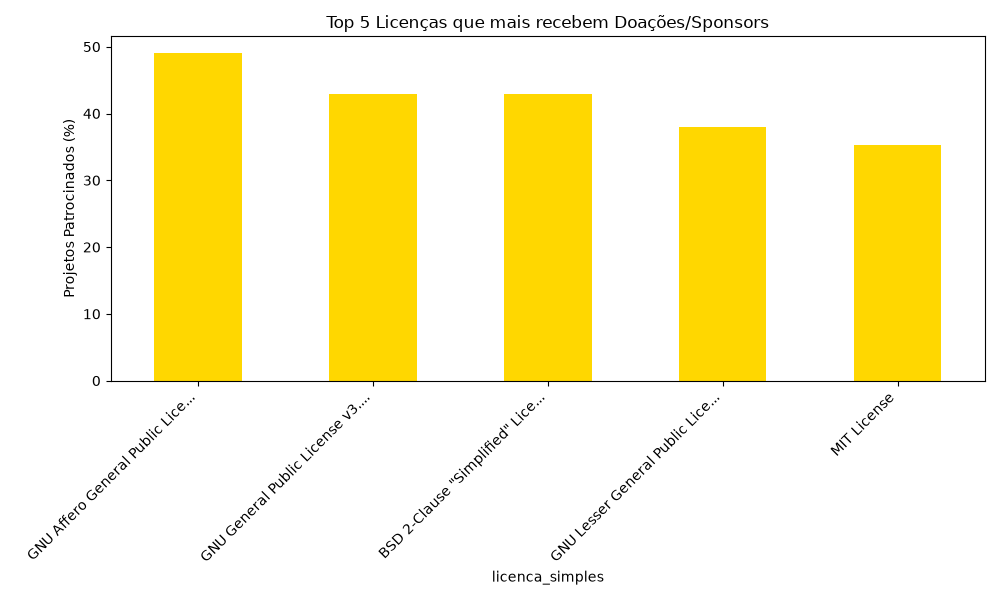

# Relatório de Insights: Ecossistema GitHub

Este relatório apresenta análises estruturais, tendências e correlações extraídas dos dados dos repositórios mais populares.

## 1. Top Linguagens do Ecosistema
Observamos que as linguagens mais predominantes ditam o mercado atual de desenvolvimento, com liderança destacada das linguagens web e ciência de dados.

## 2. A Explosão da Inteligência Artificial
A partir de 2022/2023, o número de projetos com foco em IA (LLMs, GPTs, ML) explodiu, tornando o Python a principal linguagem contemporânea para inovação open-source.

## 3. Tamanho do Projeto e Manutenção
Fica claro que projetos pequenos tendem a ser "abandonados" com o dobro de frequência em relação aos repositórios massivos, provando que grande volume de código atrai maior comprometimento da comunidade a longo prazo.

## 4. O Comportamento das Licenças e Doações
Licenças Copyleft (como AGPL e GPL) lideram o ranking de repositórios que pedem doações e suporte comunitário, contrastando com repositórios MIT que muitas vezes são mantidos por corporações.

*Dados extraídos e estruturados dinamicamente em site_data.json*
