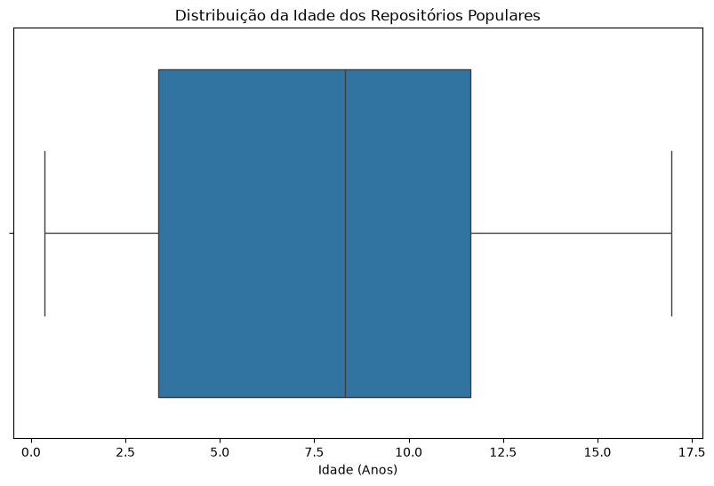
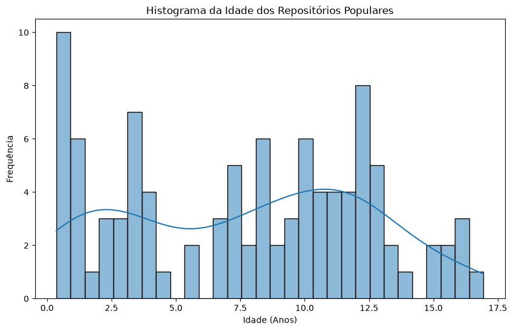

**RQ 01.** Sistemas populares são maduros/antigos?
Métrica: idade do repositório (calculado a partir da data de sua criação)

---

### Resultados

- **Mediana**: 8.32 anos
- **Média**: 7.74 anos
- **Desvio Padrão**: 4.78 anos

### Conclusão

A mediana da idade dos 1000 repositórios mais populares é de aproximadamente **8,32 anos**. Isso indica que, em geral, sistemas populares no GitHub são **maduros e antigos**, exigindo uma quantidade significativa de tempo de desenvolvimento e consolidação de comunidade para alcançar um alto número de estrelas, desmentindo a ideia de que o sucesso open-source costuma ser instantâneo.

### Visualizações

#### Distribuição da Idade (Boxplot)

#### Histograma da Idade
