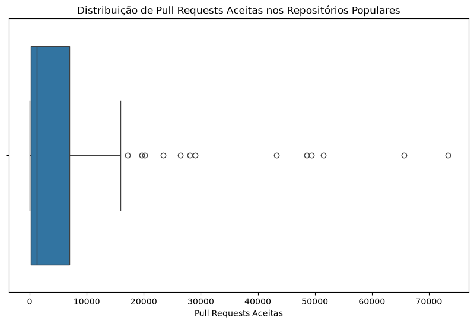
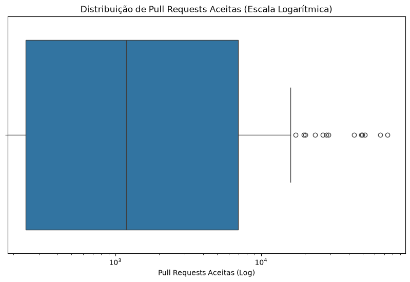
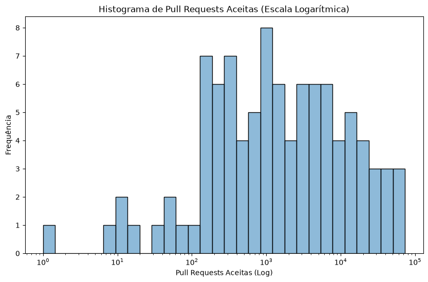

**RQ 02.** Sistemas populares recebem muita contribuição externa?
Métrica: total de pull requests aceitas

---

### Resultados

- **Mediana**: 1187.50 pull requests
- **Média**: 7251.42 pull requests
- **Desvio Padrão**: 14064.95 pull requests

### Conclusão

A mediana de pull requests aceitas é expressiva (**1187 PRs**), o que demonstra que repositórios populares **recebem um alto volume de contribuição externa**. O valor elevadíssimo do desvio padrão e da média (em relação à mediana) aponta para a existência de repositórios excepcionais (*outliers*) que possuem um número colossal de contribuições aceitas. De modo geral, esse alto grau de aceitação de PRs confirma que a colaboração aberta da comunidade é um fator central na construção e manutenção dos grandes repositórios de software.

### Visualizações

#### Distribuição de PRs Aceitas (Boxplot)

#### Distribuição de PRs Aceitas (Boxplot - Escala Logarítmica)

#### Histograma de PRs Aceitas (Escala Logarítmica)
